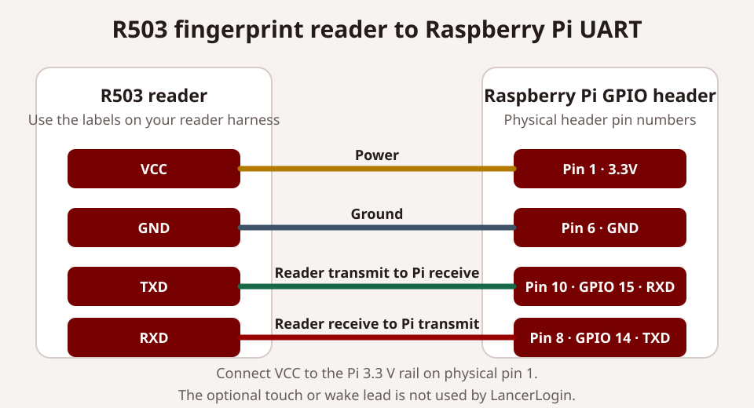

# Physical kiosk

This guide is for Operators who run attendance and Administrators who pair, monitor, or recover a Raspberry Pi kiosk. Supported hardware is a Raspberry Pi 3B+, 4, or 5 with at least 1 GB RAM, a Waveshare 7-inch DSI LCD (E), an R503 fingerprint reader, and Wi-Fi or Ethernet. Fingerprint templates remain exclusively inside the R503.

The dashboard's Kiosks page keeps physical heartbeat, reader, network, queue, sync, and release health together. When Discord is enabled and verified, the same physical-health card lets an Admin or Operator manually refresh the persistent kiosk-status message; automatic heartbeat and five-minute reconciliation remain best-effort and never block kiosk operation.

## Assemble the enclosure

The enclosure CAD is available in [Onshape](https://cad.onshape.com/documents/255122503ddb0de539e7c548/w/e84888f58700fc04a13850fb/e/b577b6bf33e1b0cef5140c36). Print one case, one case back, and two screen brackets with no support material.

Before opening the electronics packaging, gather:

- Eight M3 heat-set inserts and eight matching M3 × 6 socket-cap screws.
- A Raspberry Pi 3B+, 4, or 5; a Waveshare 7-inch DSI LCD (E); and an R503 reader.
- The display's own Pi mounting hardware and DSI ribbon cable.

Install all eight heat-set inserts in the case before beginning assembly. Use the temperature appropriate for the printed material, press each insert straight into its pocket until flush, and let the plastic cool before threading a screw. The M3 × 6 screws close the printed enclosure at the insert locations. Use the display's supplied mounting hardware for the Pi-to-display connection unless the display documentation specifies otherwise.

1. Put the display face down on a clean, nonconductive surface. Attach the Raspberry Pi to the display with its mounting screws or standoffs. Do not over-tighten the display board.
2. Connect the DSI ribbon cable between the display and Pi. Fully seat both ends, close their retaining tabs, and check the cable orientation against the marks on the boards.
3. Press the included reader nut into the matching pocket in the front case. Thread the R503 reader into that nut from the outside of the case. Tighten it only enough to prevent movement and leave the cable free of twists.
4. Lower the Pi-and-display assembly into the case with the display facing the front opening. Keep the DSI cable inside its intended path and do not trap it under a standoff or case edge.
5. Connect the R503 lead to the Pi UART using the pinout below. Confirm the reader's printed pin labels before applying power. Do not rely on wire color alone.
6. Fit the two screen brackets, then secure the display assembly using the prepared M3 × 6 screws. Confirm that the screen sits squarely and that no cable is pinched.
7. Place the case back over the assembly, arrange the remaining cable slack away from screw posts, and fasten it with the remaining M3 × 6 screws. Stop if a screw does not start cleanly in its insert.

### R503 UART pinout



Power the reader from the Pi's 3.3 V rail. Confirm the reader's printed pin labels and included wiring diagram before connecting power. LancerLogin uses only the UART connection at the /dev/serial0 device; an optional reader touch or wake lead is not connected.

| R503 label | Raspberry Pi physical header pin | Raspberry Pi signal |
| --- | --- | --- |
| VCC | 1 | 3.3 V |
| GND | 6 | Ground |
| TXD | 10 | GPIO 15 / RXD |
| RXD | 8 | GPIO 14 / TXD |

The transmit and receive lines cross: reader TXD goes to Pi RXD, and reader RXD goes to Pi TXD. If the reader label, voltage requirement, or harness differs from this table, stop and use the reader's supplied wiring documentation before powering the kiosk.

## Install or upgrade the Pi

The Kiosks page links the guided installer from the latest immutable GitHub release. Run it with `--dry-run` to preview or `--install` with `sudo` to proceed. It requires Raspberry Pi OS, Node.js 18 or newer at `/usr/bin/node`, NetworkManager, and an enabled UART exposed as `/dev/serial0`.

The installer verifies the Pi model, memory, CPU architecture, artifact checksum, serial prerequisites, and local service health. It uses a dedicated `lancerlogin` account, installs code under `/opt/lancerlogin`, keeps owner-only state under `/var/lib/lancerlogin`, configures the serial port before every systemd start, and opens local Chromium in kiosk mode at desktop login. When Chromium is installed, it also adds a **LancerLogin Kiosk** desktop shortcut for reopening the local attendance screen full-screen if the Pi is sitting at the desktop. An ordinary upgrade retains pairing, branding, pending events, slot mappings, and the local settings PIN.

LancerLogin never takes port 8788 from another program. If a pre-community or other kiosk service still uses the port, the installer prints the owning process and exits. Stop or uninstall that service intentionally, then rerun the installer. On a failed health check it prints the current systemd status and recent journal entries.

## Pair without typing deployment details on the Pi

A fresh install starts an unpaired local page and prints both `http://<hostname>.local:8788/` and the Pi's LAN IP fallback. On a phone or laptop connected to the same network:

1. Open dashboard **Kiosks** and choose **Add kiosk**.
2. Name the device and create the ten-minute one-time pairing key.
3. Open the Pi address printed by the installer.
4. Paste the single combined key and choose **Pair kiosk**.
5. Return to Kiosks and refresh status.

The combined key contains public routing information, the chosen kiosk name, and a single-use code. The Pi sends it directly to the adopter-owned Worker, clears the field, discards the combined key, and stores only the returned kiosk credential with owner-only permissions. D1 stores only hashes of the pairing code and device credential.

LAN clients can reach setup assets, safe health state, and first pairing. Attendance, reader, network, fingerprint, mapping, and maintenance controls require a request from the Pi itself. Once paired, the pairing endpoint refuses another key.

LancerLogin currently permits one active physical kiosk. Creating a replacement key requires explicit Admin confirmation; the current kiosk keeps working until the replacement redeems it. Successful replacement disables the old credential and retains the old device in Kiosks history.

## Everyday scanning

The local service continuously polls the R503. A member places an enrolled finger on the reader; there is no meeting selector, roster entry, or administrator control on the normal screen. The Pi queues a non-biometric event locally, and the Worker selects the one eligible meeting from the scan timestamp. Meeting attendance windows cannot overlap, including the shared late-scan allowance.

The first accepted scan welcomes the member and records arrival. The second says goodbye and records departure. The screen and R503 aura light provide ready, processing, welcome, goodbye, unknown-finger, rejected, reader-offline, and cloud-offline feedback. An eight-second device debounce prevents one held finger from producing both scans.

Organization name, subtitle, logo, logo contrast treatment, and colors are cached locally. A transparent logo uses the configured adaptive backdrop. If cloud delivery fails, the atomic local queue retains events in order and retries. Server rejections move out of the pending list so later valid scans can proceed, but remain in an owner-only local review record with a safe reason code. When the reader is online, the footer shows the running LancerLogin release (or a development fallback); a reader failure replaces it with the offline warning. Queue count and uptime remain beside it.

Offline queued scans keep **Welcome** or **Goodbye** as the headline, with exactly **Saved for sync | Welcome** or **Saved for sync | Goodbye** beneath it. This is a display estimate, not confirmation: the Worker still resolves attendance from the original timestamp, and queued events contain no inferred direction. Each member's currently pending sequence starts with Welcome and alternates; all fingers mapped to that member share the sequence. Other members, unknown fingers and debounced scans do not advance it. A failed local save shows a rejection instead of claiming the scan was saved.

If a network replay takes more than one second, the scanner shows the saved-for-sync estimate and resumes reading fingers while delivery continues. A later replay result does not change that earlier screen message. The operator review record captures later server rejections.

No extra direction history, member labels or biometric data are persisted. After a service restart, the existing durable queue supplies the pending sequence. Confirmed, duplicate and rejected events stop contributing when replay removes them; subsequent scans recalculate from the remaining queue, including after partial replay or background sync. When a member has no pending events, the next offline sequence starts at Welcome regardless of earlier confirmed attendance. This conservative reset can differ from the final Worker outcome. Reconnection never changes an already displayed estimate into cloud confirmation; directly acknowledged scans keep the normal authoritative feedback. Outside a scan, the network indicator continues to show connection/cloud availability.

After unlocking the local settings PIN in maintenance, choose **Review rejected scans**. The local page shows the original scan time, roster member ID, event ID, and a safe rejection reason. Check the meeting, roster, and attendance in the dashboard before using its audited correction workflow. **Mark reviewed** only records that the local item was examined; it never creates or changes attendance. An owner-only outcomes file retains the rejected item after review. The pending queue remains in its release 1.0.6 array format. Local `/health` reports saved, pending, accepted, duplicate, and rejected counts since outcome recording began. These are kiosk-observed outcomes: an acknowledgement lost during power interruption can appear as a duplicate on retry even when the Worker had accepted the first attempt. An upgraded queue marks earlier history as incomplete, and running older kiosk code again can leave a gap in these counts. The counts do not include scans that were never saved locally.

## Touch Wi-Fi settings

Press and hold the network dot for three seconds. If the Pi is offline, the network page opens automatically. On first use, create a 6–12 digit local settings PIN; later visits require that PIN and five failed attempts lock entry for 30 seconds. An authorized session lasts five minutes.

The page shows NetworkManager connection state and visible Wi-Fi networks, including signal and lock indicators. Select a network and use the on-screen keyboard. The password is passed to NetworkManager for connection and is never saved or displayed by LancerLogin. Ethernet continues to work without configuration.

Captive-portal automation is unsupported. Complete a portal outside LancerLogin or use Ethernet/offline-first scanning until normal connectivity is available.

## Fingerprint maintenance

Press and hold the organization logo or name for three seconds, then enter the same local settings PIN. There is no visible fingerprint shortcut on the attendance screen. Before unlock, the maintenance page shows PIN entry and a return-to-kiosk link. Maintenance is deliberately available only on the physical kiosk.

The page can test the reader, load active roster labels through the paired Worker, suggest the next open slot, and guide enrollment. Choose a member from the touch-friendly roster picker, choose a fixed finger label, and enter a slot from 0–199 with the on-screen number pad. Search the roster with the in-app QWERTY keyboard (including digits, hyphen, apostrophe and period). Use **Hide keyboard** to give the complete roster the full list width; **Show keyboard** or tapping search brings the keyboard back. Swipe from user rows or blank space inside the list to reach every member; a swipe never selects a member, while a tap does. Finger choices also use an in-page touch picker. Swipe inside cards, mapping tables and picker sheets to reach overflowing content at 800×480, 1024×600 and short 800×360 landscape sizes; no OS keyboard or scrollbar dragging is required. Slot edits are applied only with **Use slot**, and closing the keypad retains the previous slot.

Confirm or cancel the enrollment summary before reader listening begins; occupied-slot replacement still requires the explicit replacement checkbox and confirmation. Mapping removal has an in-page confirmation and retains the sensor template. Return to kiosk closes the local PIN session; expiration hides the workspace, open pickers and search keyboard, then requires unlock again. Cancellation at the summary starts no sensor operation; after confirmation the existing two-scan sensor operation runs to success or reader failure.

The member presents the same finger twice; the R503 creates and stores the template internally. Replacing an occupied slot requires explicit confirmation. Reader errors are shown as plain recovery guidance rather than protocol codes.

The owner-only local mapping records only the sensor slot, roster member ID, and finger label. Removing a mapping does not delete the sensor template. LancerLogin never reads, serializes, logs, syncs, backs up, or stores a fingerprint template outside the R503.

## File-based roster and slot-mapping import

If an older kiosk used the same physical R503 sensor, its stored fingerprint templates can stay in place. Export the old roster to CSV and the old slot mapping to JSON, then run:

```bash
node apps/kiosk/scripts/prepare-legacy-fingerprint-import.mjs --roster old-roster.csv --mappings old-mappings.json --out-dir ./legacy-import
```

The helper writes `lancerlogin-roster-import.csv` for the dashboard roster importer, `slot-mappings.json` for the Pi's local mapping store, and `import-report.json` listing mappings whose member IDs were not found in the roster export. Review that report before copying mappings onto a Pi. The helper reads exported files only; it does not connect to an older deployment, modify Cloudflare resources, or extract biometric templates.

## Dashboard management and recovery

Operators can monitor the active kiosk's online state, reader state, pending scan count, last successful sync, installed release, heartbeat, pairing time, and scrubbed issue category. Admins can also add/replace, rename, retire, view history, and queue fixed recovery actions:

- **Reload display** asks the local browser page to reload.
- **Restart software** restarts the sandboxed systemd service.
- **Reboot Pi** requests a device reboot after explicit confirmation.
- **Reset network PIN** removes only the local salted PIN record after explicit confirmation; the next local visit creates a new one.
- **Update to latest stable** starts a fixed, root-owned update unit. It resolves the official latest release once, accepts strict stable `vMAJOR.MINOR.PATCH` versions across majors, rejects draft or prerelease releases and missing installer, archive, or checksum assets, verifies the installer and kiosk archive checksums, then restarts the kiosk service. It does not accept an Administrator-provided URL, tag, shell command, or argument.

The paired kiosk polls for these commands every five seconds. Commands expire from polling after 15 minutes. The API accepts no shell text or arbitrary arguments, and the service account receives only narrow NetworkManager, reboot, and one-unit update permissions.

## Update a physical kiosk

The kiosk update is separate from a web update. It changes the Raspberry Pi software only. It does not create a dashboard backup, deploy the web installation, or repair a failed web update.

1. As an Administrator, open **Kiosks** or **Settings → Updates**. Confirm that the physical kiosk is online and that a newer compatible stable release is shown.
2. Choose **Update to latest stable**. The kiosk normally receives the fixed command within five seconds, then the update card reports its result and the kiosk returns online with its installed release.
3. If the release lookup is unavailable or the card does not show a successful installed version, do not assume an update was queued or completed. Check the kiosk status and use the approved on-device recovery path instead of repeatedly submitting the command.

Use the Administrator's available access method for an approved on-device recovery procedure. Raspberry Pi Connect remote shell, SSH, and direct local access are all compatible with LancerLogin when the installation permits them. An authorized operator can start the existing no-argument `lancerlogin-update.service` when an operational recovery procedure calls for it. The unit invokes only the installed verified helper, which resolves the official stable release and accepts no user-supplied arguments.

Before manual recovery, preserve a private checkpoint of the local state and retain the installation's web backup through approved secure storage. The local state directory includes pairing credentials, mappings, PIN state, pending attendance, and retained scan outcomes. Do not copy it into source control, chat, or a support ticket. Do not delete local state, re-pair, recreate resources, restore D1, or restore an old queue automatically. Restoring a historical queue can duplicate or discard attendance.

If checksum, helper, or health verification fails, stop and keep the checkpoint. The updater attempts to restart a kiosk that was active before its failure, but it does not restore earlier code bytes. An authorized operator should inspect scrubbed service status through their available access method and choose a reviewed recovery action that preserves the current queue and pairing state.

### Historical V1 migration context

v1.2.3 is the stable public release. The earlier v0.24.0 bridge and its exact-release bootstrap were historical migration procedures, not current update instructions. A dashboard release lookup can be unavailable, so treat a missing completion status as unconfirmed and use an approved recovery procedure rather than guessing the cause.

An isolated rehearsal can retain a stale reload card after a manual version change. Simulator, source, and rehearsal results do not establish physical kiosk acceptance for an installation.

## Browser simulator boundary

The existing guided-setup simulator is Admin-only and credential-separated. It can submit simulated attendance to an Admin-selected active meeting without claiming fingerprint, UART, Pi, Chromium, or physical queue acceptance.

The browser simulator reuses the physical kiosk display styles and state transitions in a scaled 800 by 480 preview, including organization branding, scan feedback and the footer. It omits physical network and maintenance controls. The themed member and meeting selectors replace reader input, and resulting attendance remains marked as simulated.
